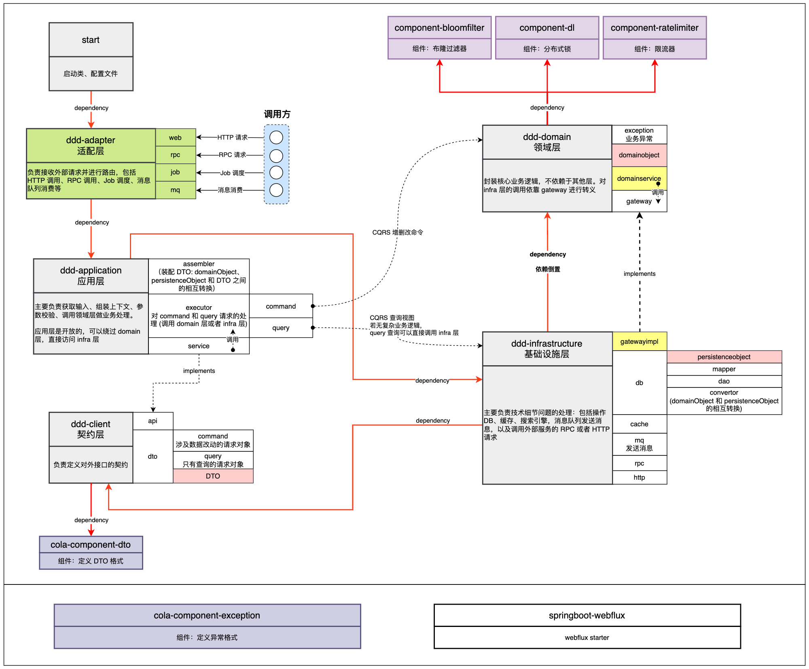

# EZLink: High Performance short URL & Analytics System
## Overall structure & COLA DDD model (Alibaba) 

credit:@Veal98
## Workflow details
- [Workflow](./WORKFLOW_EN.md)
- [Workflow_Chinese](./WORKFLOW_CN.md)

# Tech Stack & Background
1. Domain Driven Design
2. Reactor model：Spring WebFlux
3. Snowflake 
4. Distributed Lock
5. Chain of Responsibility
6. TransmittableThreadLocal
7. MQ：Kafka
8. Spring Scheduled
9. Cache：Redis
10. BloomFilter
11. Dubbo Admin (RPC)


# Launch the MiniURL & EZlink
- Port reset (optional)
```
net stop winnat
net start winnat
```
- Dependecies installation & docker image compose (You have to turn of CPU Virtualization)
```
docker-compose up -d
```
- Run the Application
```
 mvn springboot:run
```

